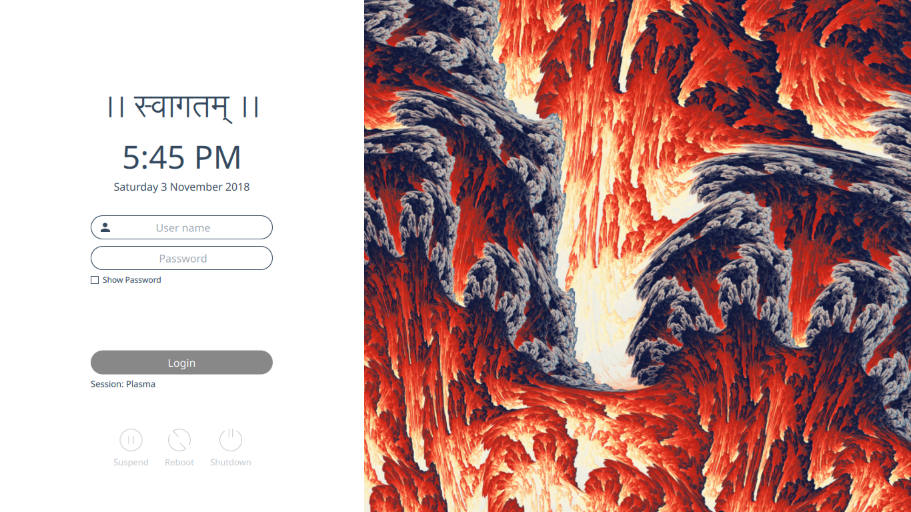

# Sugar Light login theme for SDDM
## Breeze Color Version

Fork of Sugar Light login theme for SDDM

See https://github.com/MarianArlt/sddm-sugar-light/blob/master/README.md (Original Repo) for installation and configuration.

## What's changed in this version

Font Size customized to 12. Color and accent taken from official Breeze KDE palette from HIG https://community.kde.org/KDE_Visual_Design_Group/HIG/Color.

Welcome message is in my own langage. It can be overwritten in /usr/share/sddm/themes/breeze-light-sugar/theme.conf via the variable HeaderText
